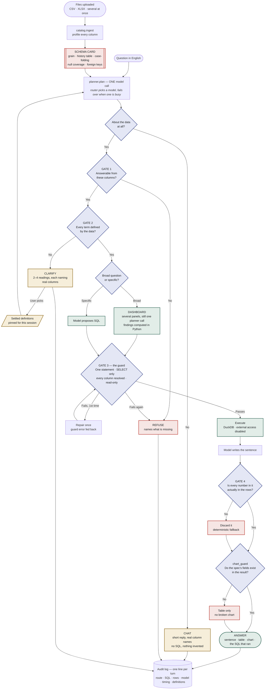

# plumb — how a question becomes an answer

One planner call decides the route. Four gates stand between that decision and
anything a user sees, and three of them exist to overrule the model.

Read it top to bottom.

---

## What each gate is for

**Gate 1 — answerable at all?** The first question is not *what is the SQL*, it is
*can these columns answer this*. "Why is attrition going up" is causal; the sheet
holds statuses and dates, not causes. It refuses and says what is missing rather
than inventing a proxy.

**Gate 2 — is every term defined?** "Top performers" — top by what? "Headcount" —
including leavers? Those live in someone's head, not in the data. It asks, with
readings that name real columns, and the choice is pinned for the session and
shown on every answer that depends on it.

**Gate 3 — the guard.** The model has written SQL and it still does not run.
Parsed into a syntax tree, every column resolved against the real schema, one
statement, SELECT only, row cap. Fail once and the error goes back for a repair;
fail twice and you get an honest refusal instead of a broken query.

A read-only DuckDB connection is not a security boundary — `read_csv_auto` still
reads any path on disk and `COPY ... TO` still writes files — so external access
is disabled as well.

**Gate 4 — check the model's homework.** The query ran, so the numbers are real,
but the model still writes the sentence about them. Every number in it must appear
in the returned rows. If one does not, the sentence is discarded for a
deterministic fallback. Years, dates and figures from the question are context; an
invented total fails.

**And the same pattern for charts.** The model authors the Vega-Lite spec, and
`chart_guard` checks every field against the columns the query actually returned.
Invalid Vega-Lite renders a blank chart instead of throwing, so that failure would
otherwise be silent.

---

## Three things the diagram simplifies

**Gates 1 and 2 are decided inside the single planner call**, not as separate model
calls. They are drawn as separate decisions because that is how the logic reads,
not because they cost separate requests.

**The router sits behind `planner.plan`.** Every free tier is rate-limited low
enough to hit inside one demo — Groq 30 requests a minute, OpenRouter's free models
20 a minute and 50 a day. When one provider is busy the router moves to the next
rather than surfacing "your question was never answered."

**A dashboard is several answers in one turn.** Each panel carries its own SQL
through Gate 3 independently, so one bad panel cannot abort the others, and every
finding is computed in Python from the returned rows.

**`endpoint_guard` is not on this path.** It runs when a custom provider endpoint
is configured, not per question: a user-supplied URL is untrusted input in the same
way generated SQL is, so it gets scheme checks, a resolved-address check, no
redirects, and a port allowlist.

---

The diagram renders on GitHub as-is. Delete the `classDef` and `class` lines to let
Mermaid use its own theme.
