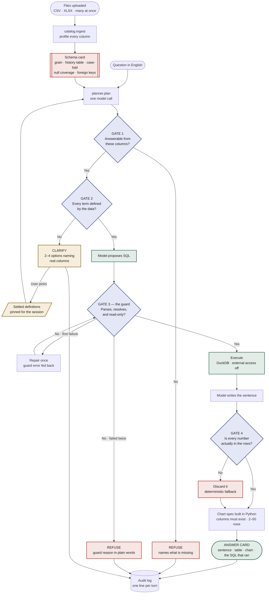
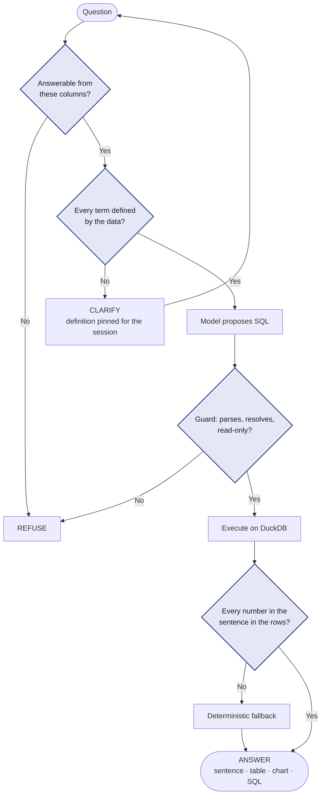

# plumb — decision flow

Four gates stand between a question and an answer. Three of them exist to overrule the
language model. That is the whole design.

GitHub renders Mermaid natively, so both diagrams below display in the repo. Copy either
block into the README, a doc, or mermaid.live.

---

## Full flow

---

## Compact — for the README

---

## What each gate is for

**Gate 1 — answerable at all?** The first question isn't *what's the SQL*, it's *can these
columns answer this*. "Why is attrition going up" is causal; the sheet has statuses and
dates, not causes. It refuses and says what's missing rather than inventing a proxy.

**Gate 2 — is every term defined?** "Top performers" — top by what? "Headcount" — including
leavers? Those live in someone's head, not in the data. It asks, with options naming real
columns, and the choice is pinned for the session and shown on every answer that uses it.

**Gate 3 — the guard.** The model has written SQL and it still doesn't run. Parsed into a
syntax tree, every column resolved against the real schema, one statement, SELECT only, row
cap. Fail once and the error goes back for a repair; fail twice and you get an honest
refusal. A read-only DuckDB connection is not a security boundary — `read_csv_auto` still
reads any path and `COPY ... TO` still writes files — so external access is disabled too.

**Gate 4 — check the model's homework.** The query ran, so the numbers are real, but the
model still writes the sentence about them. Every number in it must appear in the returned
rows. If one doesn't, the sentence is discarded for a deterministic fallback. Years, dates
and figures from the question are context; an invented total fails.

The colours are hardcoded, so they won't follow dark mode. Delete the `classDef` and `class`
lines to let Mermaid use its own theme.
