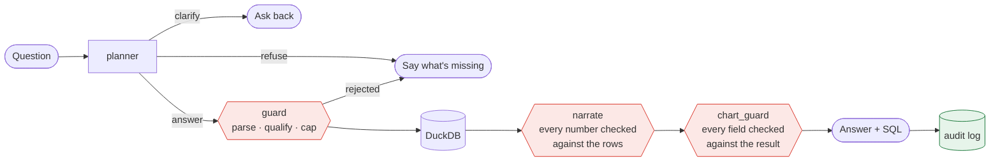

<div align="center">

# plumb

### Answers you can check.

Ask a spreadsheet a question in English. plumb shows you the SQL it ran —
or asks what your term means, or tells you the columns cannot support the question.

**It does not guess.**

[](https://plumb.iamabhinay.com)
[](https://github.com/abhinay-hat/plumb/actions/workflows/ci.yml)


</div>

---

## The whole idea

Most "chat with your data" tools answer everything. That is the problem — a
confident wrong number is worse than no number, because nobody checks it.

plumb routes every question to one of five outcomes, and shows its work:

| Route | When | What you get |
|---|---|---|
| **answer** | The columns support the question | Narration, chart, table, and the exact SQL |
| **clarify** | A business term isn't defined by the data | The term named, options to pick — and the choice sticks |
| **refuse** | The data cannot answer it | What is missing, in plain words |
| **chat** | Not a data question | A reply, no SQL |
| **dashboard** | "Give me an overview" | Several panels, one model call |

```
You:    Who are our top performers?
plumb:  What should "top performers" mean?
        · Highest performance_rating   · Longest tenure   · Highest salary

You:    [Highest performance_rating]
plumb:  14 rows. Rohan Pillai, Ananya Menon and Vikram Chopra all rate 5.
        SELECT name, performance_rating FROM employees ORDER BY ...

You:    Why is attrition going up?
plumb:  This sheet has status and hire dates. It has no causes.
```

---

## Quick start

```bash
export GROQ_API_KEY=gsk_...
docker compose up --build
```

Open <http://localhost:8000>, drop `fixtures/employees.csv`, and ask.

<details>
<summary><b>Without Docker</b></summary>

```bash
python -m venv .venv && source .venv/bin/activate
pip install -r requirements.txt
make setup    # points git at .githooks/ — once per clone
make build
make dev      # API on :8000, Vite on :5173
```
</details>

<details>
<summary><b>Run it on your own machine, no API key</b></summary>

```bash
export PLUMB_PROVIDER=ollama
export PLUMB_MODEL=qwen2.5-coder:7b-instruct   # optional; this is the default
```

Ollama must be listening on `http://localhost:11434`.
</details>

---

## How a question becomes an answer



**Three of the four gates exist to overrule the language model.** That is the design.

1. **Ingest** — every sheet lands in one DuckDB, so joins across files work. The
   schema card carries grain, history-table warnings, case-folding collisions
   and null coverage, not just names and types.
2. **Guard** — generated SQL is parsed to an AST, qualified against the real
   schema, and capped. A read-only DuckDB connection is *not* a security
   boundary: it still allows `read_csv_auto('/etc/passwd')`.
3. **Verify** — every number in the narration must appear in the returned rows,
   or the narration is discarded and replaced.
4. **Chart** — the model authors Vega-Lite; `chart_guard` validates every field
   against the actual result before it reaches the browser. Vega renders an
   invalid spec as a *blank chart* rather than throwing, so unvalidated specs
   fail silently.

FastAPI and React wrap that seam. **They never decide the route.**

---

## Runs on whatever is free

Every free tier is small enough to exhaust mid-demo — Groq allows 30 requests a
minute, OpenRouter's free models 50 a day. So plumb treats providers as a pool:
a rate limit marks that candidate as cooling, using the provider's own
`Retry-After`, and the turn moves to the next one.

The roster is **discovered, not declared** — asked of each provider's
`/v1/models` and filtered on what the payload publishes. A hand-kept list is
wrong the moment a provider retires a model.

<details>
<summary><b>Bring your own endpoint</b> — vLLM, LM Studio, LiteLLM, any OpenAI-compatible gateway</summary>

```bash
export PLUMB_PROVIDER=custom
export PLUMB_CUSTOM_URL=http://localhost:11434/v1/chat/completions
export PLUMB_CUSTOM_MODEL=qwen2.5-coder:7b-instruct
# PLUMB_CUSTOM_KEY=                 # optional
# PLUMB_ALLOW_PRIVATE_ENDPOINTS=1   # required for 10/8, 172.16/12, 192.168/16
```

The URL is untrusted input. plumb checks the scheme, resolves the host, pins
that address, refuses redirects, and allows only ports 443, 80, 8000, 8080,
11434 and 1234 — the same discipline as the SQL guard. A key typed into the UI
lives on the session, never in process-wide env, and never in the audit log.
</details>

---

## I attacked it before anyone else could

I generated an 11,806-row HR workbook — eight joinable sheets — and planted
defects that produce **plausible wrong answers rather than crashes**. Then I
red-teamed against ground truth computed independently in DuckDB.

It failed three:

- **"What's the average salary?"** returned the mean of 1,303 *historical*
  compensation rows — 2.04 per employee. One person's four raises, counted four
  times.
- **Hyderabad showed 183 people.** It has 187. Four rows spell it `hyderabad`.
- **An average rating** was reported without mentioning 52 of 1,300 values were
  null.

All three were one defect: the schema card described what the columns *were*
and nothing about what shape the data was *in*. The model reasoned correctly
from what it was told, and it was not told enough.

> **The SQL is not the lie; the question the SQL answers is.**

Full report: [`qa/RED-TEAM.md`](qa/RED-TEAM.md)

---

## Numbers

```bash
make test    # 265 tests, no LLM required
make eval    # 30 questions against a live provider
```

**Routing eval: 27/30**, recorded 20 September 2026, `openai/gpt-oss-20b` on
Groq, across both fixtures. **Prompts were not tuned against this set before
recording that number.** The misses are routing disagreements, not wrong
numbers — `What's our headcount?` was specified as clarify and answered as
`count(*)`. See [`evals/results.md`](evals/results.md).

`make test` covers the deterministic modules — guard, catalog, chart,
chart_guard, narration verification, router, session store, rate limits, HTTP
surface. Anything that *routes* or *narrates* needs a live provider, which is
why the routing number lives in `make eval` and not in the suite.

---

## Limitations

Stated plainly, because the whole point of this thing is not overclaiming.

- **Sessions are in memory**, dropped after two hours idle. Refresh and the
  spreadsheet is gone. The audit log is the only durable record.
- **`SELECT` only.** No writes, no multiple statements, no files outside the upload.
- **Definitions last one session.** There is no metric layer.
- **Routing is the model's.** `headcount` is sometimes counted instead of
  clarified; some prediction questions clarify instead of refusing.
- **Typing is heuristic.** Mixed columns become VARCHAR; dates convert only
  above a 90% parse rate.
- **No authentication.** Anyone who can reach the process can query the loaded
  sheet. `PLUMB_RATE_LIMIT_PER_MIN` caps requests per client;
  `PLUMB_MAX_UPLOAD_MB` (32) and `PLUMB_MAX_FILES` (10) cap uploads.
- **Free tiers run out.** A rate-limited planner call is reported as a provider
  error, never as a refusal — your data is not the problem, and it should not
  be blamed.

---

<div align="center">

[`DESIGN.md`](DESIGN.md) — engineering rationale · [`FLOW.md`](FLOW.md) — decision flow · [`WRITEUP.md`](WRITEUP.md) — approach and decisions

</div>
